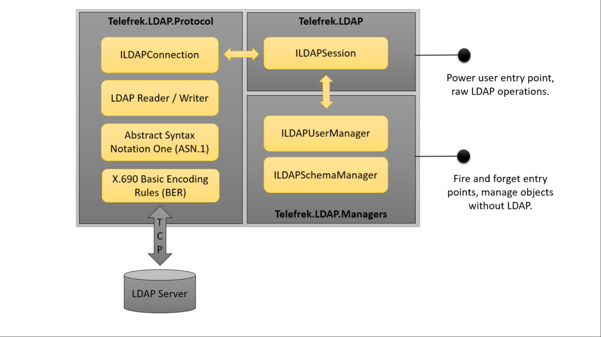

# LDAP

Lightweight Directory Access Protocol library for dotnet Core.

Build Status (Alpha)

[](https://travis-ci.org/telefrek/ldap)

# Local Setup

Ensure you have docker setup and then run the following command prior to running tests:

```docker run --rm -it --env LDAP_TLS_VERIFY_CLIENT=allow -p 10389:389 -p 10636:636 osixia/openldap```

# Overview

This package is designed to work with dotnet Core & aspnet Core to allow easy LDAP integration for novice and experienced LDAP administrators.  It is compliant with [RFC 4511 ](docs/rfc4511.txt "RFC Text") and supports TLS (preferred) and raw TCP connections using a simple [ILDAPSession](LDAP/ILDAPSession.cs) interface to perform CRUD operations on a basic [LDAPObject](LDAP/LDAPObject.cs).  These interactions are asynchronous and supports unit testing as well as the current aspnet Dependency Injection pattern.  Users who don't wish to work with the raw LDAP protocol can leverage one of the [Manager](LDAP/Managers/README.md) classes, which have boilerplate code for manipulating users, domains and other schema objects in a more friendly interface.



# Examples

Coming soon